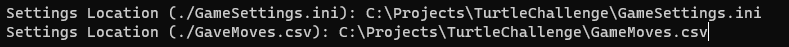
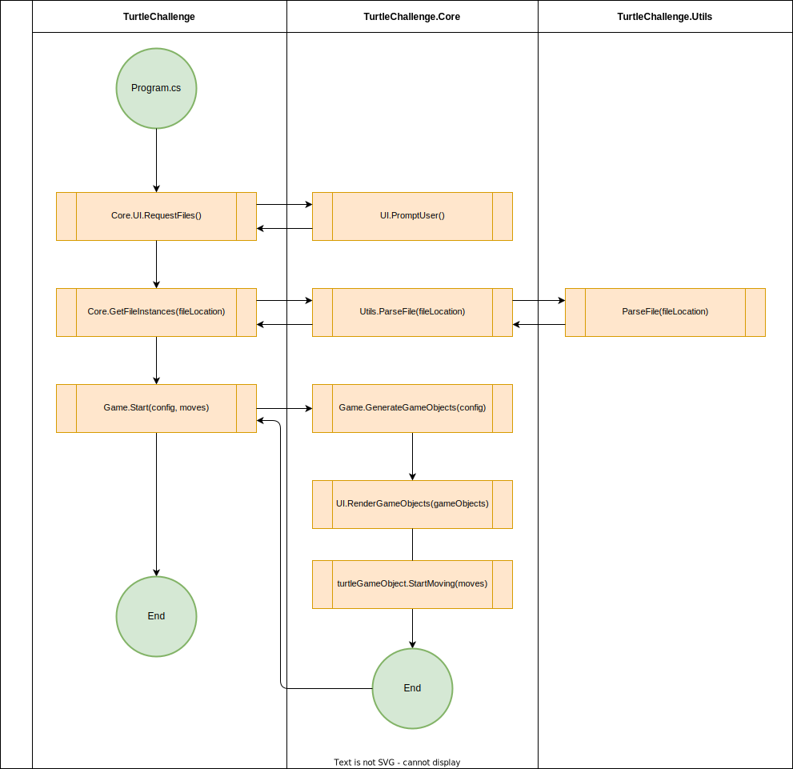

# TurtleChallenge
This challenge was presented to me in a job interview. The goal was simple, but it seemed to fun for me to not add some additional sprinkle.


# How To Use
1. Create two files in a place of your choice. The recommended settings are as follows:

    **GaveMoves.csv**
    ```csv
    m,r,m,m,m,m,r,m,r,r,r,m
    ```

    **GameSettings.ini**
    ```ini
    [Board]
    BoardX = 6
    BoardY = 5

    [Game Coordinates]
    StartPositionX = 0
    StartPositionY = 1
    StartDir = North

    ExitX = 5
    ExitY = 1

    MinesXY = "1,1 3,1 3,3"
    ```
2. On the IDE of your choice, run [Program.cs](TurtleChallenge/Program.cs) and enter the locations of the files created in the previous step.

    
3. Press Enter and You're good to go!

# Architecture
As was having more fun than I probably should have, I experimented a little and implemented some things based on [Unity](https://unity.com/) (See the list [below](#items-based-on-unity-workflow)). Besides that, it uses a simple project division:

- [TurtleChallenge](TurtleChallenge/README.md)
- [TurtleChallenge.Core](TurtleChallenge.Core/README.md)
- [TurtleChallenge.Utils](TurtleChallenge.Utils/README.md)

The first one is the entry point of the game, and just makes a few calls to the other projects; the other two are the ones that handles all of the processing and generation of the game. See a high level example below.



## Objects based on the Unity workflow
- [GameObjects](TurtleChallenge.Core/Models/Core/GameObject.cs)
- Even-driven [Collisions](TurtleChallenge.Core/Models/Core/CollisionEvent.cs) between GameObjects
- [Vector2](TurtleChallenge.Core/Models/Core/Vector2.cs) coordinates

# Known limitations
- It does now handle well boards'sizes bigger than the console window
- It allows you to place GameObjects outside the board boundaries
- It does not gracefully handle wrong file locations
